# Blogging Platform

## Introduction

Welcome to the Blogging Platform! This project is designed to provide a comprehensive solution for managing authors and their blog posts. With a user-friendly interface and robust backend, users can efficiently create, update, and view authors and their associated posts. The application leverages Laravel’s powerful features along with Bootstrap and Tailwind CSS to deliver a modern and responsive web experience.

## Features

The Blogging Platform includes the following key features:
- **Author Management**: Users can manage authors by adding new entries, updating existing ones, and viewing all authors.
- **Post Management**: Users can manage blog posts by creating new posts, editing existing ones, and viewing all posts.
- **User Authentication**: Secure login and registration functionality to manage user sessions. User cannot add/update/delete Authors and Posts if not Authenticated.

## Database Schema

### Authors Table

- **id** (Primary Key, Auto Increment, Integer)
- **name** (String, 255 characters)
- **email** (String, 255 characters, Unique)
- **created_at** (Timestamp)
- **updated_at** (Timestamp)

### Posts Table

- **id** (Primary Key, Auto Increment, Integer)
- **title** (String, 255 characters)
- **body** (Text)
- **author_id** (Foreign Key, Integer, References `authors(id)`)
- **created_at** (Timestamp)
- **updated_at** (Timestamp)

## Screenshots

Here are some screenshots demonstrating the user flow of the application:

1. **Home Page**:
   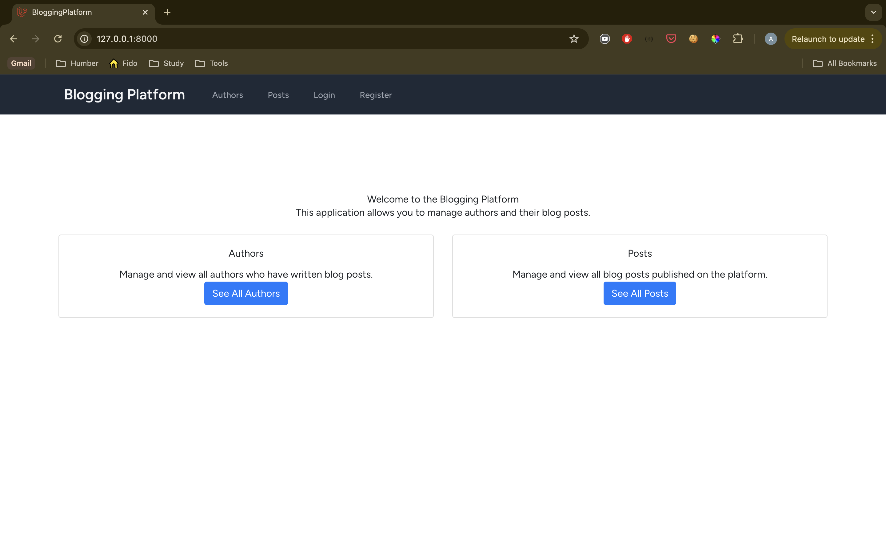

2. **Login Page**:
   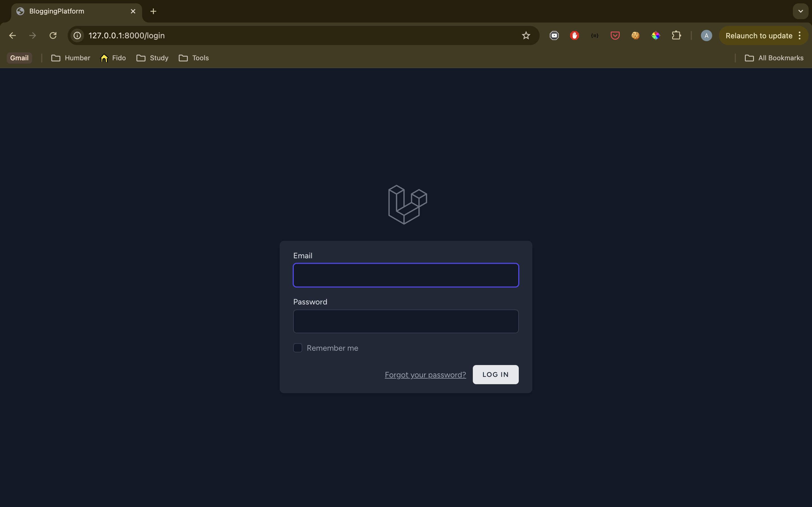

3. **Register Page**:
   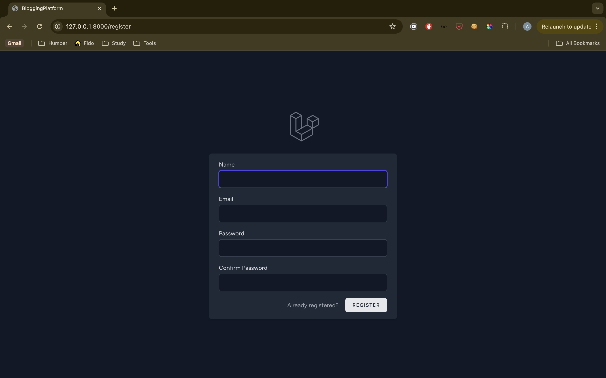

4. **View All Authors**:
   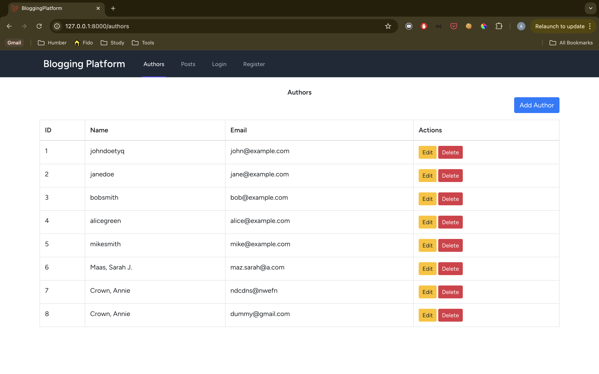

5. **View All Posts**:
   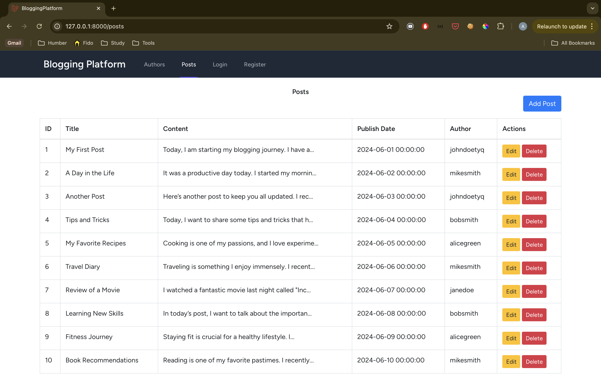

6. **Add New Author**:
   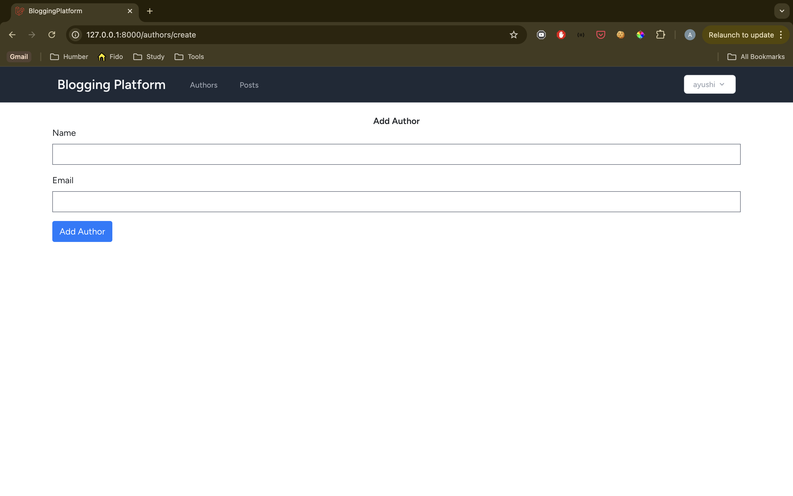

7. **Add New Post**:
   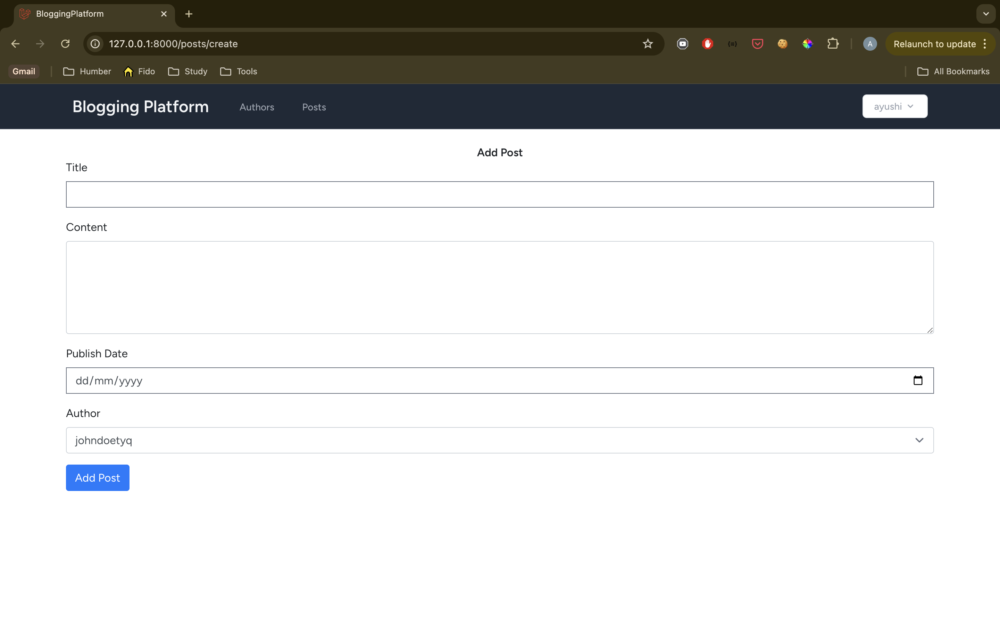

8. **Update Author**:
   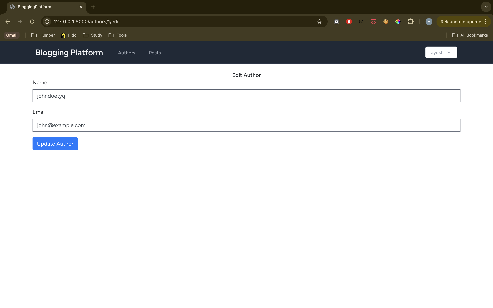

9. **Update Post**:
   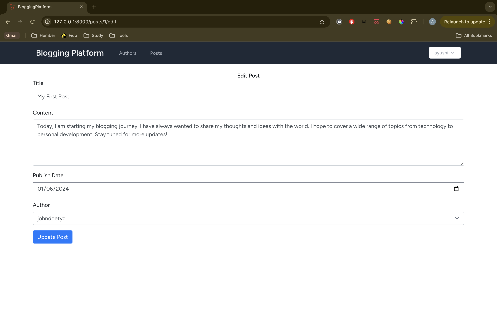

10. **Delete Author**:
   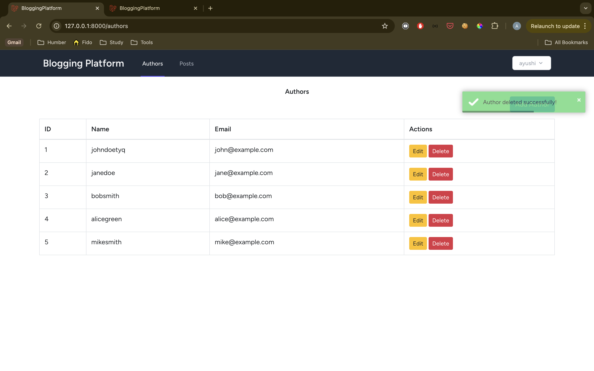

11. **Delete Post**:
   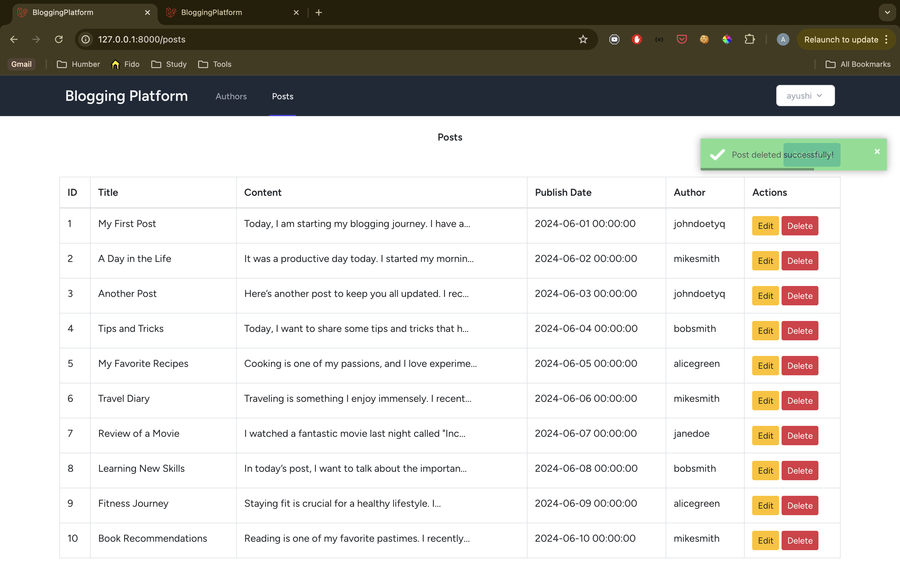

## Thoughts on Laravel

Working with Laravel has been an insightful experience. The framework’s elegant syntax and powerful features significantly streamline the development process. I particularly enjoyed using Laravel’s Eloquent ORM for database interactions and its built-in authentication system. It is much better than PHP where the syntax is very confusing and debugging is quite frustrating at times.

## Directory Structure

- `app/Http/Controllers`: Contains controllers for handling requests.
- `resources/views`: Contains Blade templates for the frontend.
- `routes/web.php`: Defines the application routes.

## Technologies Used

- **Laravel**: PHP framework for building the application.
- **Bootstrap**: CSS framework for styling and responsive design.
- **Tailwind CSS**: Utility-first CSS framework for custom styling.
- **Toastr.js**: JavaScript library for displaying notifications.